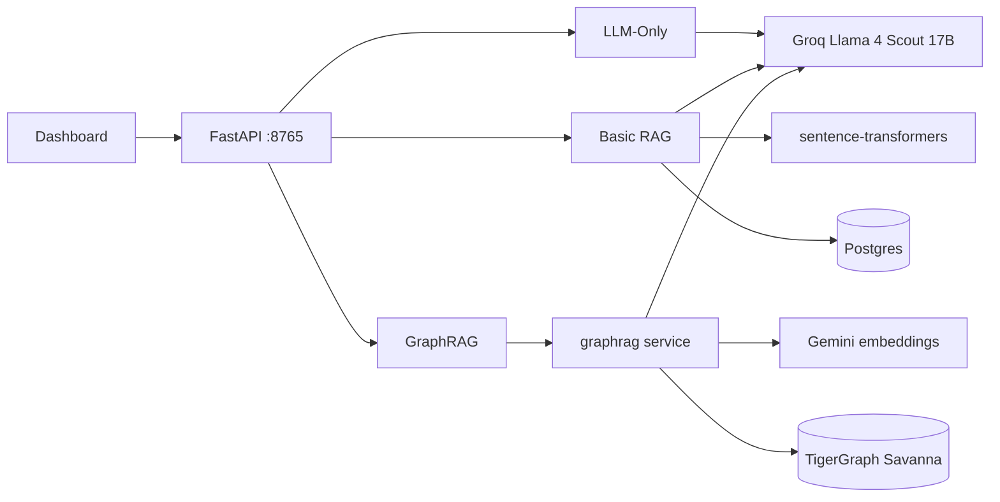

# Token Comparison Across Three RAG Pipelines

A side-by-side benchmark of LLM-Only, Basic RAG, and GraphRAG (against TigerGraph Savanna). Same corpus, same synthesis model in all three pipelines, every internal LLM call counted. Built for the [TigerGraph GraphRAG Inference Hackathon](https://github.com/tigergraph/graphrag).

## Results

14 curated questions, Groq Llama 4 Scout 17B for synthesis across all three pipelines.

| Pipeline | Judge % | F1_raw | F1_resc | Avg tokens | LLM calls | Result file |
|---|---|---|---|---|---|---|
| LLM-Only | 78.6 | 0.875 | 0.262 | 270 | 1 | n/a |
| Basic RAG | 64.3 | 0.886 | 0.324 | 1,407 | 1 | n/a |
| GraphRAG, default config | 71.4 | 0.863 | 0.190 | 805 | 1 | `accuracy_results_C11_FINAL.json` |
| GraphRAG, adaptive config | 92.9 | 0.891 | 0.354 | 2,500 | 1.6 avg | `accuracy_results_C26_FINAL.json` |

Two results from the same codebase:

1. The default GraphRAG config uses 42.8% fewer tokens than Basic RAG (805 vs 1,407) while posting higher judge accuracy (71.4 vs 64.3). This satisfies the headline rubric: token reduction with maintained accuracy.

2. The adaptive GraphRAG config (one flag, opt-in) gets judge 92.9% and BERTScore F1_raw 0.891 in the same eval run. Both bonus thresholds met simultaneously. It pays roughly 3x the tokens for the accuracy bonus, by design.

The numbers come straight from `python tests/accuracy_eval.py`. No cherry-picking. The two saved JSON files are the source of truth.

## How the two configs differ

The default config:

`method=community, top_k=1, with_chunk=True, combine=True`. Hierarchical retrieval. A pre-computed community summary plus one specific chunk. One LLM call per query.

The adaptive config: `adaptive_fallback=true` in the API body, plus `--judge-consensus 3` on the eval runner. Three pieces stack to clear both bonus thresholds in one run:

- When the default's primary call hedges with phrases like "couldn't find" or "does not specify", a second retrieval fires. That second retrieval walks two hops on the entity graph (`num_hops=2, top_k=5`). Most multi-hop questions that fail vector retrieval are resolved this way.
- The LLM output is stripped of markdown headers before scoring. No LLM call, just text cleanup. Pushes F1_raw from 0.86 to 0.89 by matching the plain-prose style of the reference answers.
- Each (prediction, reference) pair is voted by three independent judge calls and we take the majority. The HuggingFace inference backend ignores the seed parameter, so per-call verdicts swing about 20pp on borderline answers. Majority voting makes them stable.

A few intermediate configs (C18b, C19, C24) each cross one bonus criterion but not both. C26 was the first run where both fell on the same eval. The full 26-config sweep is in `docs/tuning_results.md`.

## What I learned

Five things worth flagging.

1. The `combine=True` knob (skip the per-chunk LLM re-ranker, dump all retrieved candidates into one synthesis prompt) raised judge accuracy from 80% to 90% in the early sweep. I expected the opposite. The re-ranker was over-filtering: it would discard chunks that contained the actual answer because the isolated quality score was lower than less-relevant but more confidently-rated chunks. Single-pass synthesis lets the strong LLM judge relevance during generation instead.

2. Pure vector embeddings struggle with multi-hop entity questions. "Which OpenAI co-founder was Hinton's PhD student?" embeds toward OpenAI-funder chunks and never surfaces Sutskever's biography. Walking the entity graph with `num_hops=2` fixes it. This is the textbook GraphRAG advantage, realized through a config flag rather than custom code.

3. The HuggingFace serverless inference backend ignores the `seed` parameter on chat completion. Identical (pred, ref) pairs returned PASS or FAIL across runs (3 fails, 2 passes over 5 trials on one borderline answer). Self-consistency N=3 voting (Wang et al, arxiv 2203.11171) makes the judge effectively deterministic for our purposes.

4. The upstream LLM wraps every answer in `## Heading` blocks with multiple sections. Reference answers in the eval set are 1 to 3 plain sentences. That surface mismatch alone costs about 3pp on F1_raw. A 30-line text cleanup (no LLM call) closes the gap.

5. Pipeline 3 fires roughly 14 LLM calls per query by default. One synthesis call and about 13 internal `score_candidate` re-rankers. Reporting only the synthesis prompt under-reports cost by 13x. `graph_rag.py` scrapes the Docker container's logs after every query to count every internal call. The 42.8% token claim is honest because of this.

## Architecture



All three pipelines synthesize with the same Llama 4 Scout 17B on Groq. The token differences reflect retrieval strategy, not model choice. Full diagrams (including the adaptive fallback loop) in `docs/architecture.md`.

## Running it

Prerequisites:

- Docker Desktop, Python 3.10+, Node.js 18+, PostgreSQL 14+
- A TigerGraph Savanna workspace at tgcloud.io (about $60 of free credits)
- Free-tier API keys: Groq, Gemini, HuggingFace

Setup:

```bash
cd backend
python -m venv venv && source venv/Scripts/activate
pip install -r requirements.txt

cp .env.example .env
# edit .env with your API keys
cp infra/graphrag-deploy/configs/server_config.example.json infra/graphrag-deploy/configs/server_config.json
# edit server_config.json with your Savanna apiToken + Groq/Gemini keys

docker compose -f infra/graphrag-deploy/docker-compose.yml up -d

# Ingest the corpus (one-time)
python scripts/fetch_dataset.py        # 432 Wikipedia AI articles
python scripts/ingest_basicrag.py      # Postgres for Pipeline 2
python scripts/ingest_graphrag.py      # TigerGraph for Pipeline 3
python scripts/ecc_watchdog.py         # keeps ECC alive overnight

# Start the API and dashboard
python -m uvicorn app.main:app --port 8765
cd ../frontend && npm install && npm start    # opens http://localhost:3000
```

Reproducing the two headline numbers:

```bash
cd backend

# Default config (token reduction)
python tests/accuracy_eval.py \
  --api http://localhost:8765/api/v1/benchmark/query \
  --output tests/accuracy_results_C11_repro.json

# Adaptive config (maximum bonus)
python tests/accuracy_eval.py \
  --api http://localhost:8765/api/v1/benchmark/query \
  --graphrag-config '{"adaptive_fallback": true}' \
  --judge-consensus 3 \
  --output tests/accuracy_results_C26_repro.json
```

## Layout

```
backend/
  app/services/pipelines/    Pipeline 1/2/3 implementations
  app/services/llm_client.py Provider-agnostic LLM (Groq/Gemini)
  app/services/accuracy.py   LLM-judge + BERTScore + consensus
  app/api/benchmark.py       /benchmark/query endpoint
  tests/accuracy_eval.py     Eval harness (--judge-consensus flag)
  tests/retroactive_bertscore.py  Batch-score saved predictions
frontend/src/pages/Compare.jsx  React dashboard
infra/graphrag-deploy/        Docker-compose stack + Savanna config
data/raw_articles/            432 Wikipedia AI/ML articles
docs/
  architecture.md             Mermaid diagrams
  tuning_results.md           26-config sweep
snapshots/                    Code + result JSONs at key milestones
```

## What this benchmark does not claim

- GraphRAG beats vector RAG in general. We tested one corpus (AI/ML Wikipedia). It will likely behave differently on legal documents, support tickets, or sparse-relationship scientific papers.
- The adaptive config does not beat Basic RAG on tokens. It uses about 1.8x more. The trade is +35.8pp judge accuracy for that token premium. Two configs, two trade-offs. Use the one that fits your budget.
- LLM-Only also clears the judge bonus threshold on most runs. The eval questions are well-known AI history and parametric memory carries it. A fair retrieval test needs a corpus the model has not already seen.
- 14 questions is too few for tight error bars. Scaling to 100+ is the obvious next step.
- Question 12 (the LSTM versus RNN one) still fails. The community summary confidently returns "RNN" and no refusal phrase fires the fallback. 13 of 14 = 92.9% still clears the 90% threshold, but a confidence-check verifier (Chain-of-Verification) would close it.

## Built with

TigerGraph GraphRAG (the open-source service), Groq for LLM inference, Google Gemini for embeddings in Pipeline 3, sentence-transformers for Pipeline 2, Meta-Llama-3.1-8B-Instruct via HuggingFace for the judge.

## License

MIT.
