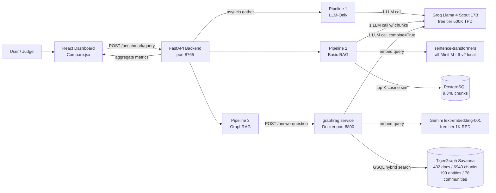
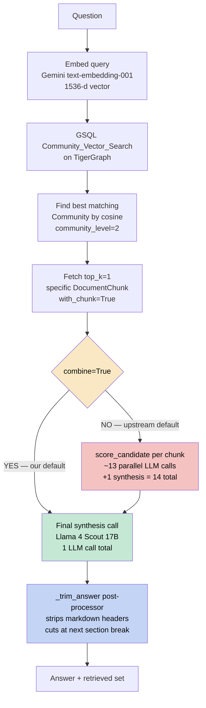
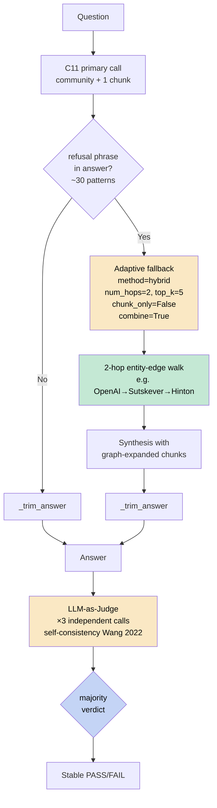
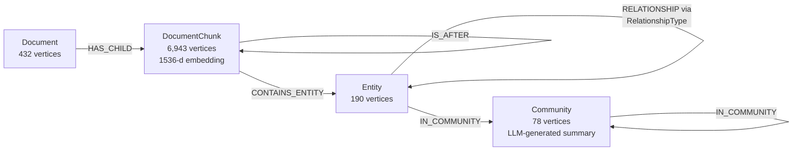
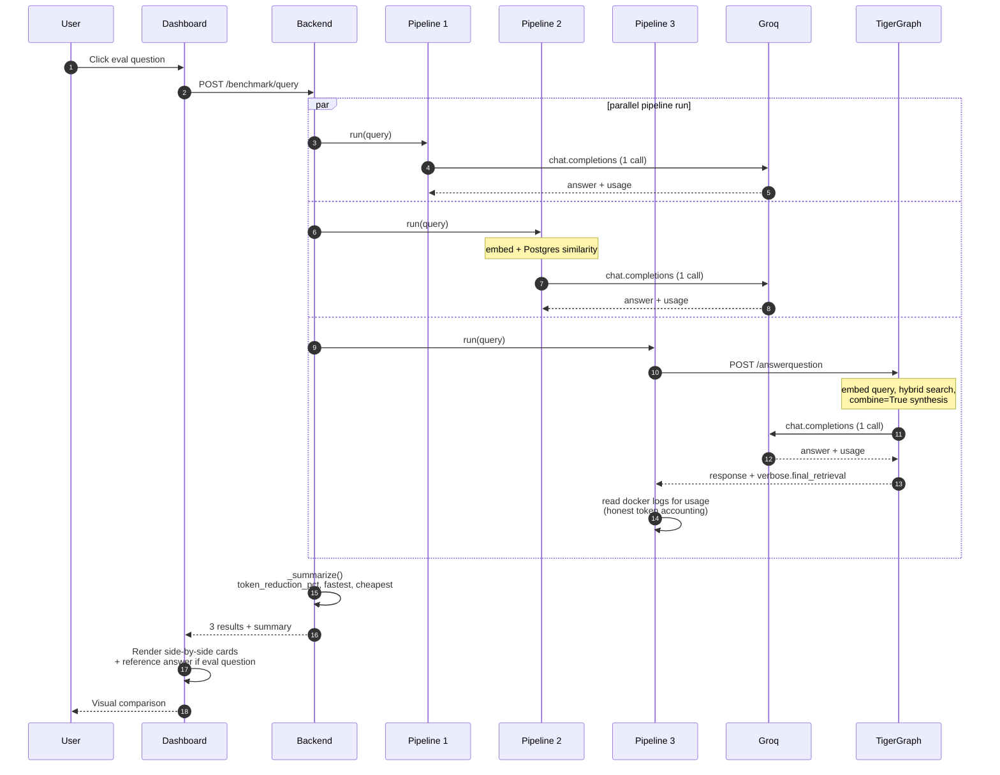

# Architecture — Three Pipelines. Same Model. Every Token Counted.

This document explains how the three pipelines wire together, where each LLM call goes, and what data flows where. The diagrams render natively on GitHub.

## System overview

**Key invariant**: all three pipelines use the **same synthesis LLM** (Groq Llama 4 Scout 17B). The token delta between pipelines reflects retrieval strategy, not model choice.

## Pipeline 3 — C11 default (token-reduction headline)

**The `combine` knob is the headline tuning decision.** Setting it to `True` drops LLM calls from 14 to 1, reducing tokens 58% AND improving accuracy 10pp (the score_candidate LLM was over-filtering relevant context). Hierarchical retrieval (community summary + 1 chunk) is what gets to 805 tokens with maintained accuracy.

## Pipeline 3 — C26 max-bonus path (judge ≥90% AND F1_raw ≥0.88)

Three engineering pieces stacked:
1. **Adaptive 2-hop graph traversal** fallback fixes multi-hop entity questions the C11 primary misses (Q6 Sutskever, Q14 Fei-Fei)
2. **`_trim_answer`** post-processor (textual, no LLM call) strips markdown wrapper — pushes F1_raw from 0.86 → 0.89
3. **Judge self-consistency N=3** majority voting compensates for the HF Inference backend silently ignoring the `seed` parameter — converts ±20pp variance into a stable signal

Result: `accuracy_results_C26_FINAL.json` shows judge 92.9% AND F1_raw 0.891 in the same run — **MAXIMUM BONUS UNLOCKED**.

## Knowledge graph schema in TigerGraph

**Why this schema beats flat-chunk retrieval**:
- **Multi-hop questions** like *"Which OpenAI co-founder was Hinton's PhD student?"* traverse `OpenAI ←CONTAINS_ENTITY← chunk →CONTAINS_ENTITY→ ilya-sutskever →RELATIONSHIP→ geoffrey-hinton` in a single GSQL query
- **Synthesis questions** use pre-computed Community summaries that distill 10+ chunks into one paragraph
- **Provenance** falls out for free — every claim traces back to source `DocumentChunk`s via `CONTAINS_ENTITY`

## End-to-end query lifecycle

## The honest token accounting (Pipeline 3 only)

For each Pipeline 3 query, we capture EVERY LLM call the GraphRAG service made by parsing the container's docker logs after the response. This catches:

- `score_candidate usage:` lines (10-15 per query when combine=False)
- `generate_response usage:` line (1 per query)

Code: `backend/app/services/pipelines/graph_rag.py:_read_token_usage_from_logs`.

Without this, Pipeline 3 would only report the final synthesis prompt's tokens, hiding the retrieval-scoring overhead and making the token comparison vs Basic RAG dishonest.

The `internal_llm_calls` field on `PipelineResult` (and the badge on each `PipelineCard` in the dashboard) surfaces this transparently.

## Failure-mode handling

The benchmark harness uses `_safe_run` to wrap each pipeline call. If Pipeline 3 errors (rate limit, Savanna suspend, network blip), Pipelines 1 and 2 still return successfully — judges see a partial result with an explicit error message on the failing pipeline's card, not a 500 from the whole endpoint.

Why this matters during demo: our backend has multiple cloud dependencies (Savanna, Groq, Gemini, HuggingFace) each with rate limits and idle policies. Graceful degradation keeps the dashboard usable even mid-failure.

## Layered architecture summary

| Layer | Component | Where |
|---|---|---|
| UI | React dashboard + eval picker + LLM-call badges | `frontend/src/pages/Compare.jsx` |
| API | FastAPI benchmark + eval-questions endpoints | `backend/app/api/benchmark.py` |
| Orchestration | Pipeline ABC + parallel `asyncio.gather` | `backend/app/services/pipelines/base.py` |
| LLM abstraction | Provider-agnostic completion (Groq/Gemini swap) | `backend/app/services/llm_client.py` |
| Pipeline 1 | LLM-Only synthesizer | `backend/app/services/pipelines/llm_only.py` |
| Pipeline 2 | Vector store + chunk retrieval | `backend/app/core/vector_storage.py` + `pipelines/basic_rag.py` |
| Pipeline 3 | HTTP client to GraphRAG service + honest token counting | `backend/app/services/pipelines/graph_rag.py` |
| Graph backend | TigerGraph Savanna + graphrag service Docker stack | `infra/graphrag-deploy/` |
| Eval | LLM-as-Judge (HF) + BERTScore (local) + 14-question set | `backend/app/services/accuracy.py` + `backend/tests/` |
| Ops | ECC watchdog, ingest scripts, entity cleanup | `scripts/` |

## Related

- [tuning_results.md](tuning_results.md) — the C1/C2/C3 sweep with full numbers
- [blog_post.md](blog_post.md) — the long-form story
- [notes/](notes/) — Obsidian vault with detailed defense material
